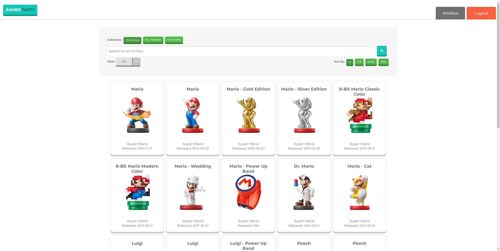
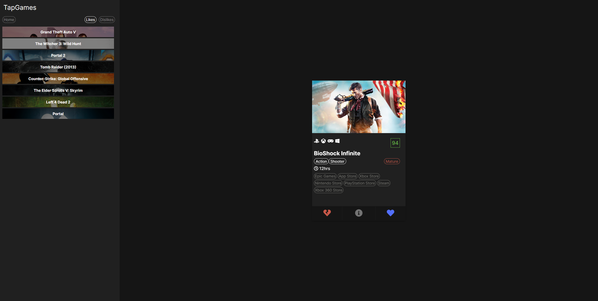
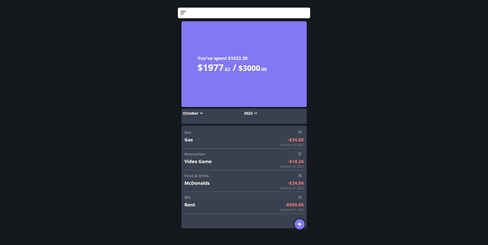

# 🖥️ Cody Stine

#### I am a Software Developer that enjoys bringing my creations to life, all projects are planned, designed and built from the ground up to solve various day to day problems with code. My main focus being on the world of web development. Where I can craft clean and beautiful websites to help solve any business needs that I am presented with.

  

## 🔥My Top Repo's

    

      
      <a href="https://github.com/CydoEntis/amiibo-party-frontend">Frontend</a>
      <a href="https://github.com/CydoEntis/amiibo-party-backend">Backend</a>
    

    
    

  

## 🧰 Languages and Tools

