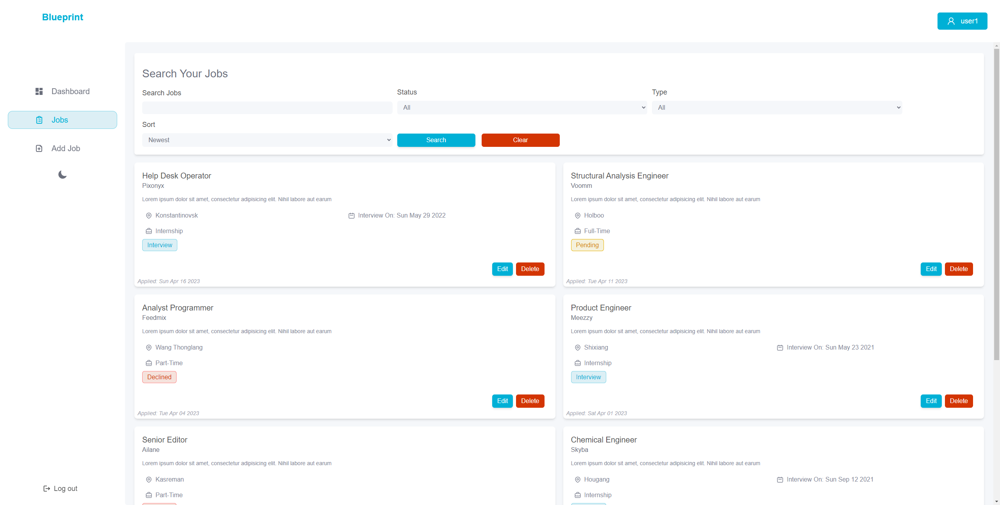

# 💫 About Me

- 🖥️ I'm currently working on SideQwest
- 👯 I'm looking to collaborate with other developers
- 🤝 I'm looking to help others build their dream software
- 🌱 I'm currently learning C# and the .NET ecosystem
- 🗨️ Ask me about SideQwest and my other projects
  

  
Find Me On:

  

---

---

# 💻 Languages

---

# ⌨️ Frameworks

---

# 🖱️ Services

---

# 🔥 My Top Repos

## [Blue Print](https://blueprint-nine.vercel.app/login)

Keep track of all your job applications, know which jobs you applied for and when or if you have an interview for them.

## [Amiibo Party](https://amiibo-party-frontend.vercel.app/)

Tracking all your amiibo's has never been so easy! Track, collect, wishlist all your current and upcoming amiibos. All kept in one place.

---

# 📊 GitHub Stats

    
    

    
    

